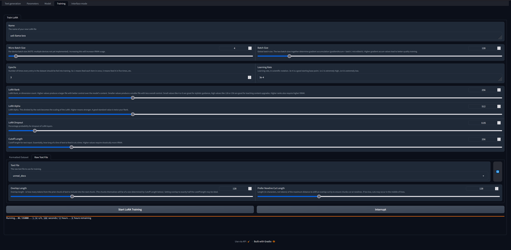
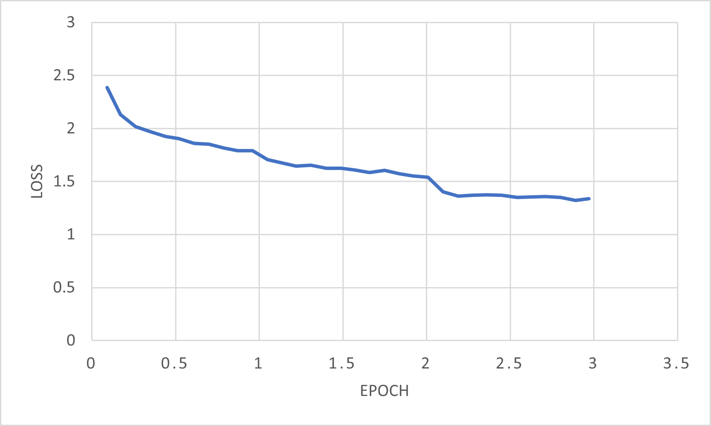
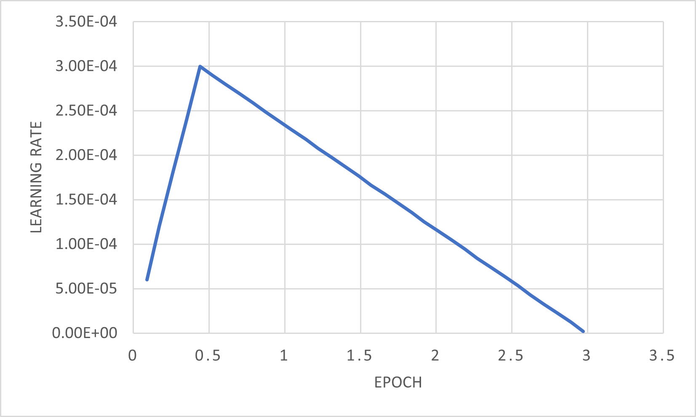
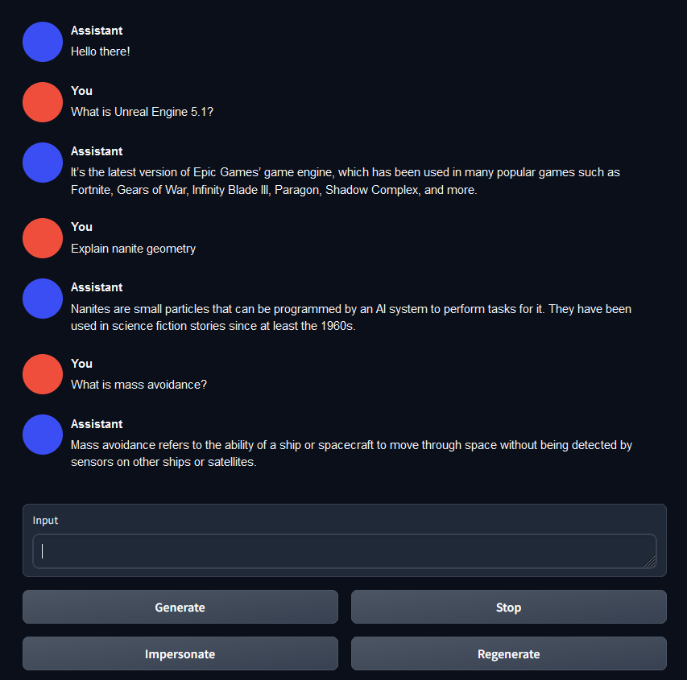
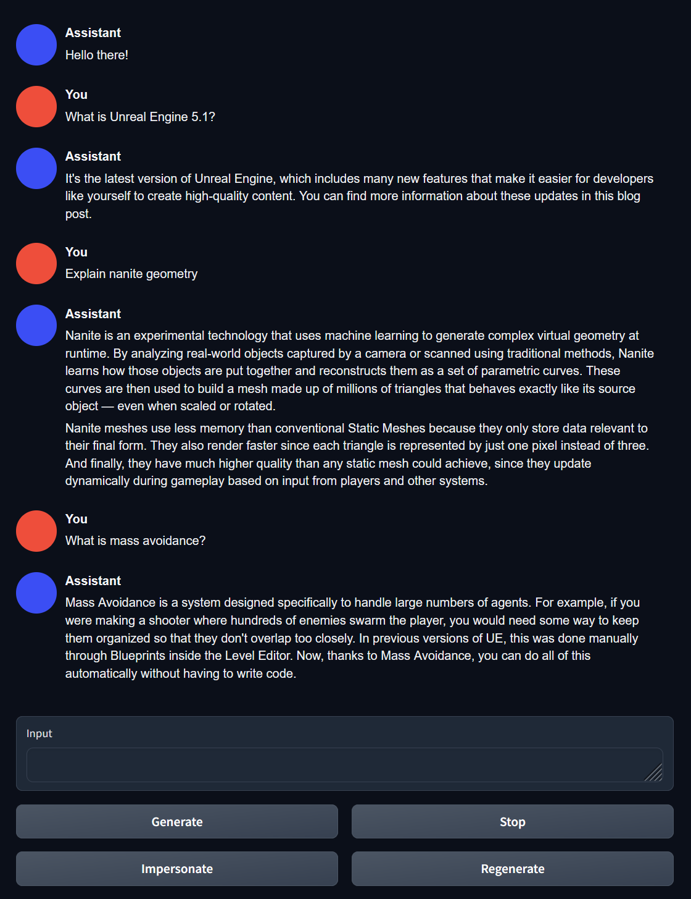
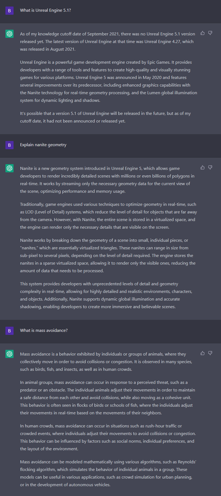

# Unreal Engine 5 Llama LoRA

## Table of Contents
- [Project Description](#project-description)
- [How to Replicate](#how-to-replicate)
- [Results and Examples](#results-and-examples)
- [Limitations and Future Improvements](#limitations-and-future-improvements)
- [License](#license)
- [Acknowledgements](#acknowledgements)

# Project Description
A proof of concept for using natural language processing (NLP) to create a documentation assistant that can intelligently respond to user queries. Specifically, I webscraped all of Unreal Engine 5.1's documentation into a single text file to use a dataset for finetuning Meta's llama-7b in [oobabooga's text generation webui](https://github.com/oobabooga/text-generation-webui). I think that locally hosted and trained LoRAs have the potential to be an interesting alternative to OpenAI API calls and vector databases for building context aware assistants to help with niche tasks and information.

# How to Replicate
You'll need to have [oobabooga's text generation webui](https://github.com/oobabooga/text-generation-webui) set up, it's a great tool with the goal of being the stable-diffusion-webui equivalent for locally running and training large language models. I suppose you could also train the LoRA some other way, but this is what I used. If you're on windows, the new one-click installer is very helpful. Once you have it up and running, you'll need to pick a base model. I used Llama-7b loaded in 8bit mode, but other models should work. Download the unreal_docs.txt file from this repository and put it in text-generation-webui/training/datasets. Then navigate over to the training tab in the webui and configure the settings:  

These are just the settings I used, I can't say for certain they are the best settings and I plan to continue to experiment with the options. As you can see, training took roughly 8 hours on a 3090ti.

## Training data
| Loss | Learning Rate |
| --- | --- |
|  | 

# Results and Examples
I fully expected complete gibberish from the first attempt, but I am pleasantly surprised by the quality of the results:
| Base Llama7b | ue5-llama-lora | ChatGPT |
| --- | --- | --- |
|  |  |  |

Clearly, base Llama 7b has no idea what's going on and can't provide information about Unreal Engine 5 or it's new features. However, when augmented with ue5-llama-lora, it has no issues generating high quality responses that are clearly derived from Unreal Engine 5.1's up-to-date documentation. While Unreal Engine 5 was released after ChatGPT's training cutoff date, it is impressively familiar with nanite, as nanite had been announced prior to September 2021. ChatGPT fails to recognize mass avoidance in the context of Unreal Engine however, as that is a much newer experimental feature in the engine.

# Limitations and Future Improvements
Being a language model, ue5-llama-lora is prone to hallucinations and can make up details or give incorrect information. That being said, this is still very much in the early stages, and the output could be improved and refined in a number of ways. The obvious thing being that it's not really advisable to use the default chat assistant from the webui for prompting. By generating a UE5-tailored character yaml file, I expect that you could slightly reduce hallucinations and have better control over the length and level of detail in the responses. Additionally, the dataset could be improved in a number of ways. Specifically if the dataset was somehow formatted as a instruction > response json like [Stanford's Alpaca](https://github.com/tatsu-lab/stanford_alpaca) I could have a lot more control through prompting. Lastly, I included the webscraping script in the repository as well, but the implementation is poor and take ages to parse the documentation. I really don't recommend using it, I was overly cautious using selenium to try to catch dynamically loaded page content. By the time I realized I could have made the script way better with a different approach, I was just too tired to care and let it run overnight.

# License
This project is licensed under the MIT License.

# Acknowledgements
Wouldn't have thought of this without [oobabooga's text generation webui](https://github.com/oobabooga/text-generation-webui) and [Stanford's Alpaca research](https://github.com/tatsu-lab/stanford_alpaca). A special thank you goes to [mcmonkey4eva](https://github.com/mcmonkey4eva), who contributed the code for the training tab in text-generation-webui.